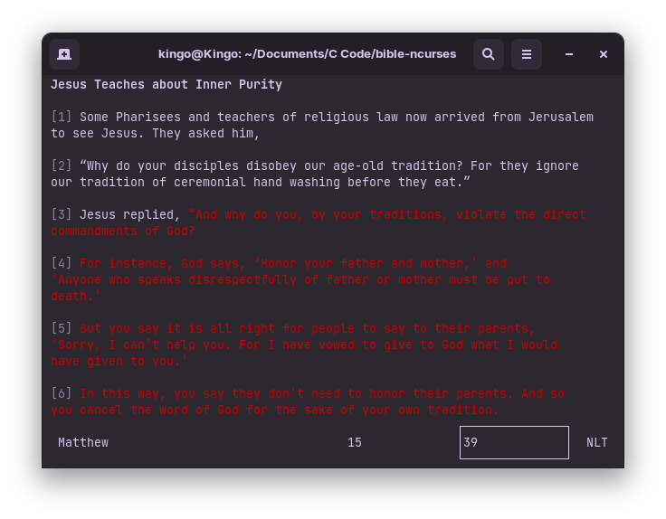

# The Bible in the terminal

I use my laptop a lot, so I thought it'll be cool to also read my Bible on it. I wanted it to be in the terminal because I use the terminal quite often.

It was meant to be a relatively quick and easy project, but I wanted to "modularize" my code (bad idea). I spent some time writing a custom input field for ncurses with quite the features. I made it very modular as if I had plans to use it in the future. It's actually pretty cool ngl. It has a ton of features and cool effects.

I intially used Python and C to create this, but I switched to solely C. I used the `sqlite3` C interface to communicate with the databases. 

Btw, `ncurses` is an API for writing terminal applications that (kinda) look like GUIs.

## Features
- **Mouse input** (this is part of the features I added to my custom input field). You can (double) click on the input fields to switch focus to it and enter text.
- **Red colour output** for the words of Jesus.
- **Stores your last visited** Bible "path" (book, chapter and verse).
- **6 Bible translations**: AMPC, KJV, MSG, NKJV, NLT, TLB (press `TAB` to switch translations).
- **Shows titles** for important parts of Scripture.
- **Auto completion** when typing in books.
- **Automatically detects** the translations stored in the `db` folder and displays them.
- **Shows the maximum** chapters and verses of a book
- You can also **pass a Bible path as an argument** in the terminal.

Yeah, you can probably see I put a lot effort into this 😅.

---
Type `make` and run `./bible` to try it out.